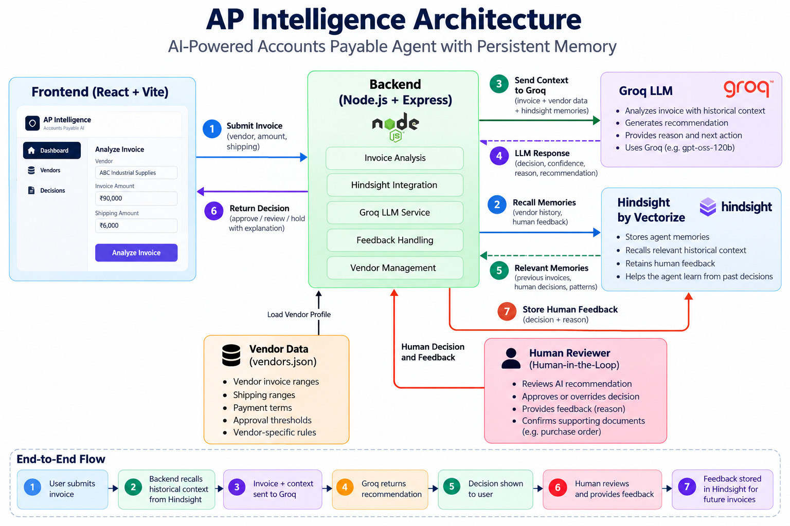

# AP Intelligence — Accounts Payable AI Agent

An AI-powered Accounts Payable agent that analyzes invoices, remembers vendor history, learns from human decisions, and uses that experience when handling future invoices.

The system combines **Groq** for AI reasoning with **Hindsight by Vectorize** for persistent agent memory.

---

## 🚀 Overview

Accounts Payable teams process large numbers of invoices and repeatedly deal with:

- Vendor-specific invoice patterns
- Unusual invoice amounts
- Shipping discrepancies
- Duplicate charges
- Approval thresholds
- Previous exceptions
- Human review decisions

Traditional automation usually evaluates each invoice independently.

**AP Intelligence takes a memory-driven approach.**

The agent remembers previous vendor interactions and human decisions through Hindsight. When a similar invoice appears later, the agent recalls relevant experience and uses it as context for its recommendation.

---

## 🎯 Problem

An Accounts Payable system should not treat every invoice as a completely new event.

For example, a vendor may normally submit:

- ₹60,000–₹80,000 invoices
- ₹3,000–₹5,000 shipping
- Net 30 payment terms

A future ₹92,000 invoice with ₹7,500 shipping should receive additional attention.

However, historical context can also matter.

If a previous high-value invoice from the same vendor was approved after purchase-order verification, that human decision can provide useful context for future invoices.

The challenge is therefore not only to analyze the current invoice, but also to:

> **Remember what happened before and use that experience when it matters.**

---

## 💡 Solution

AP Intelligence creates a memory-enabled Accounts Payable workflow.



The system follows a memory-driven agent architecture where:

- React provides the user interface.
- Node.js and Express handle invoice analysis and API requests.
- Vendor profiles provide structured business rules.
- Hindsight provides persistent agent memory.
- Groq performs AI reasoning using the current invoice and recalled historical context.
- Human decisions are retained as future memory.

---

## 🧠 How the Agent Uses Hindsight

Hindsight is the central memory layer of AP Intelligence.

### 1. Retain

The system stores important experiences such as:

- Vendor invoice patterns
- Shipping patterns
- Previous discrepancies
- Previous invoice decisions
- Human approvals
- Human review decisions
- Purchase-order verification outcomes
- Previous resolutions

### 2. Recall

Before analyzing an invoice, the agent asks Hindsight for relevant historical information.

The system performs targeted memory retrieval for:

- Vendor history
- Invoice ranges
- Shipping patterns
- Previous exceptions
- Previous decisions
- Human feedback
- Previous resolutions

Human-feedback memories are specifically prioritized so previous reviewer decisions can influence future analysis.

### 3. Learn From Human Feedback

When a human reviews an AI recommendation, the decision is retained in Hindsight.

A future invoice can then retrieve that previous decision and use it as historical context.

This creates a continuous learning loop:

```text
Invoice
   ↓
Recall historical memory
   ↓
AI recommendation
   ↓
Human review
   ↓
Human feedback
   ↓
Hindsight retains feedback
   ↓
Future invoice
   ↓
Previous experience is recalled